<p align="center">
  
</p>

<h1 align="center">Shashwat Singh</h1>
<h3 align="center">• Backend Developer •</h3>

<p align="center">


</p>

<p align="center">


</p>

---

# `GET /profile`


```http
HTTP/1.1 200 OK
Content-Type: application/json

{
  "name": "Shashwat Singh",
  "role": "Backend Developer",
  "specialization": "FastAPI • PostgreSQL • Python",
  "status": "Building Intelligent APIs",
  "open_to": [
    "Internships",
    "Projects",
    "Collaborations"
  ]
}
```


---

# `GET /current-focus`

```text
[
 ✔ AI & Machine Learning
 ✔ Backend Development with FastAPI
 ✔ PostgreSQL Database Design
 ✔ Data Analysis & Visualization
 ✔ DSA & Problem Solving
 ✔ Production-ready Applications
]
```

---

# `GET /tech-stack`

## 💻 Languages
<p></p>

## ⚙️ Backend
<p></p>

## 🗄️ Databases
<p></p>

## 🌐 Web
<p></p>

## 🤖 AI & Data
<p></p>

## 🛠 Tools
<p></p>

---

# `GET /hackathons`

```json
{
  "participated": [
    {
      "event": "Vibe2Ship Hackathon",
      "organizer": "Coding Ninjas × Google for Developers",
      "focus": "AI-powered Productivity & Backend Development"
    },
    {
      "event": "Bhartiya Antariksha Hackathon 2026",
      "organizer": "Indian Space Research Organisation (ISRO)",
      "focus": "Space Technology & Innovation"
    },
    {
      "event": "Odoo Hackathon",
      "organizer": "Odoo",
      "focus": "Full Stack Development & Problem Solving"
    }
  ]
}
```

---

# `GET /metrics`

<p align="center">


</p>

<p align="center">

</p>

---

# `GET /problem-solving`

<p align="center">

</p>

---

# `POST /connect`

<p align="center">
<a href="https://www.linkedin.com/in/singhshashwat26"></a>
<a href="mailto:shashwats2604@gmail.com"></a>
<a href="https://leetcode.com/u/shashwat_singh_2604/"></a>
<a href="https://github.com/shashwat2645"></a>
</p>

---

<p align="center">
  
</p>

